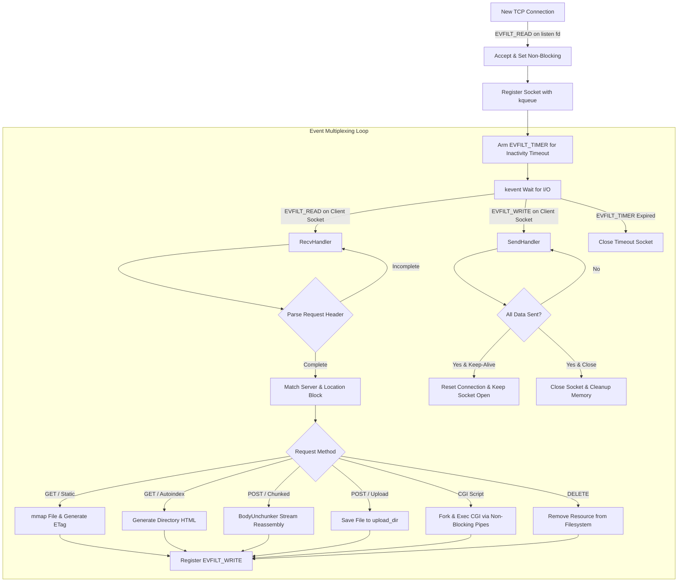

# 🌐 webserv — HTTP/1.1 Web Server

<div align="center">


**A high-performance, non-blocking, event-driven HTTP/1.1 web server with NGINX-style configuration and full CGI/1.1 execution.**

[Overview](#-overview) •
[Features](#-features) •
[Event-Driven Architecture](#-event-driven-architecture) •
[HTTP/1.1 Protocol Engine](#-http11-protocol-engine) •
[CGI/1.1 Subsystem](#-cgi11-subsystem) •
[Configuration File (.conf)](#-configuration-file-conf) •
[Compilation & Usage](#-compilation--usage) •
[Testing & Benchmarks](#-testing--benchmarks) •
[Project Architecture](#-project-architecture)

</div>

---

## 📖 Overview

**webserv** is an asynchronous HTTP/1.1 server developed in C++98 following the **42 Network / 1337** curriculum. Inspired by the architecture and configuration ergonomics of **NGINX**, the server is engineered from raw POSIX socket primitives to handle hundreds of concurrent connections reliably and efficiently without worker threads or blocking system calls.

At its core, **webserv** employs an event-driven multiplexing loop built upon the BSD **`kqueue` / `kevent`** kernel notification mechanism. The engine incorporates zero-copy memory-mapped file delivery (`mmap`), non-blocking stream handlers for request buffering and response dispatching, full HTTP/1.1 chunked transfer decoding, ETag-based caching, dynamic directory auto-indexing, and an RFC 3875-compliant Common Gateway Interface (CGI) executor supporting PHP, Python, and Perl scripts.

---

## ✨ Features

### ⚡ Non-Blocking Core & Concurrency
- **Event-Driven Multiplexing**: Sockets, timers, and CGI pipelines are monitored concurrently through `kqueue` (`EVFILT_READ`, `EVFILT_WRITE`, `EVFILT_TIMER`).
- **Zero-Copy Static File Delivery**: Serves static media and documents directly through `mmap`/`munmap`, bypassing duplicate user-space buffer allocations.
- **Graceful Timeout Management**: Automatic connection teardown for idle or slow clients managed by kernel timer filters (`EVFILT_TIMER`).
- **Resilient Signal Handling**: Guarded against `SIGPIPE` breaks when clients disconnect abruptly during read/write cycles.

### 🌐 HTTP/1.1 Protocol Conformance
- **Supported Methods**:
  - `GET`: Serves static files, renders directory listings, and executes CGI queries.
  - `POST`: Processes file uploads, passes input payloads to CGI scripts, and handles forms.
  - `DELETE`: Deletes target resources with status `204 No Content`, `404 Not Found`, or `409 Conflict`.
- **Chunked Transfer Encoding**: Streamed request bodies encoded with `Transfer-Encoding: chunked` are dynamically unchunked and reassembled on-the-fly (`BodyUnchunker`).
- **Persistent Connections**: Full support for `Connection: keep-alive` to reuse existing TCP connections across multiple HTTP transactions.
- **Client Body Limits**: Strict validation of `client_body_max_size` (supporting unit suffixes such as `M`, `G`, `k`) with immediate `413 Payload Too Large` rejection.
- **Rich MIME Registry**: Built-in detection for 80+ file extensions (HTML, CSS, JS, SVG, WebP, PNG, MP4, JSON, PDF, fonts, archives, etc.).
- **Smart Caching & Validation**:
  - Automatic `ETag` generation based on file metadata and content hash.
  - Validates `If-None-Match` and `If-Modified-Since` headers to respond with `304 Not Modified`.
- **Autoindex Engine**: On-the-fly HTML directory index generation for browsing directory hierarchies.
- **HTTP Redirections**: Configurable redirect directives supporting status codes `301`, `302`, `307`, and `308`.

### ⚙️ CGI/1.1 Dynamic Execution (RFC 3875)
- **Multi-Runtime Support**: Configurable interpreters for `.php` (`php-cgi`), `.py` (`python3`), `.pl` (`perl`), etc.
- **Environment Population**: Accurately establishes standard RFC 3875 environment variables (`REQUEST_METHOD`, `QUERY_STRING`, `CONTENT_LENGTH`, `CONTENT_TYPE`, `PATH_INFO`, `SCRIPT_FILENAME`, `HTTP_COOKIE`, `SERVER_SOFTWARE`, etc.).
- **Asynchronous IPC**: Non-blocking bidirectional pipes connecting the server event loop to forked child CGI processes.
- **Header Parsing**: Automatically extracts CGI-generated headers (such as `Set-Cookie`, `Location`, `Status`) and bundles them into the final HTTP response.

---

## 🔄 Event-Driven Architecture

The diagram below details how **webserv** processes incoming network events using **`kqueue`**:



---

## 📑 HTTP/1.1 Protocol Engine

### 1. Request Handling & Routing
1. **Header Parsing**: The request line (`METHOD URI HTTP/1.1`) is validated alongside mandatory headers. URI query parameters (`?query=value`) are split and extracted for query strings.
2. **Virtual Host Matching**: The `Host` header is cross-referenced with `server_name` directives to route traffic to the intended virtual server.
3. **Location Matching**: The URI path is matched against location blocks using longest prefix matching.
4. **Allowed Methods**: The requested method is verified against `accepted_methods`. If forbidden, the server generates a `405 Method Not Allowed` response with an `Allow` header.

### 2. Status Code Coverage

| Code | Status Text | Trigger Conditions |
|:---:|---|---|
| **`200`** | `OK` | Successful `GET` or executed CGI script |
| **`201`** | `Created` | File successfully uploaded or created |
| **`204`** | `No Content` | Resource deleted via `DELETE` |
| **`301`** | `Moved Permanently` | Directory requested without trailing slash or permanent redirection |
| **`302`** | `Found` | Standard temporary redirection |
| **`304`** | `Not Modified` | Matching `ETag` (`If-None-Match`) or `If-Modified-Since` |
| **`400`** | `Bad Request` | Malformed HTTP request syntax or header |
| **`403`** | `Forbidden` | Access denied by file permissions |
| **`404`** | `Not Found` | Requested path or script does not exist |
| **`405`** | `Method Not Allowed` | Method excluded from `accepted_methods` |
| **`409`** | `Conflict` | Resource removal collision during `DELETE` |
| **`411`** | `Length Required` | `POST` request lacking `Content-Length` or chunked header |
| **`413`** | `Payload Too Large` | Body size exceeds `client_body_max_size` |
| **`414`** | `URI Too Long` | URI exceeds maximum allowed buffer size |
| **`500`** | `Internal Server Error` | System call failure or internal unrecoverable exception |
| **`502`** | `Bad Gateway` | CGI execution failed or returned abnormal exit status |
| **`505`** | `HTTP Version Not Supported` | Request protocol is not `HTTP/1.1` |

---

## 🔌 CGI/1.1 Subsystem

Dynamic script execution conforms to the **CGI/1.1** standard. When a request targets a file matching an extension configured via `cgi <extension> <handler>`, the server performs the following:

1. **Environment Setup**:
   ```cpp
   REQUEST_METHOD     = "GET" | "POST"
   QUERY_STRING       = "user=foo&id=42"
   CONTENT_TYPE       = request["Content-Type"]
   CONTENT_LENGTH     = request["Content-Length"]
   SCRIPT_FILENAME    = "/path/to/script.php"
   PATH_INFO          = "/working/directory/"
   SERVER_NAME        = "127.0.0.1"
   SERVER_PROTOCOL    = "HTTP/1.1"
   GATEWAY_INTERFACE  = "CGI/1.1"
   SERVER_SOFTWARE    = "nginy/1.33.7"
   HTTP_COOKIE        = request["Cookie"]
   UPLOAD_DIR         = "/path/to/uploads/"
   PHP_INI_SCAN_DIR   = "./config/"
   ```
2. **Process Isolation & Piping**:
   - `pipe()` is used to pass request payloads to `stdin` of the child process.
   - Output from `stdout` is redirected and captured.
   - Non-blocking writes stream data to the CGI process without stalling server responsiveness.
3. **Response Assembly**:
   - Headers output by CGI scripts (e.g., custom `Content-Type`, `Set-Cookie`, `Status`) are separated from the body and unified into standard HTTP response envelopes.

---

## ⚙️ Configuration File (.conf)

The configuration file uses an intuitive block-structured syntax mirroring NGINX:

```nginx
server
{
    listen 0.0.0.0:8000;
    server_name 127.0.0.1:8000 localhost:8000 main_server.com:8000;
    autoindex off;
    client_body_max_size 100M;

    location /
    {
        root ./eva/www;
        accepted_methods GET POST;
        autoindex on;
        cgi php ./cgi-bin/php-cgi;
        cgi py  /usr/local/bin/python3;
        cgi pl  /usr/bin/perl;
        client_body_max_size 2M;
        error_page 404 ./eva/error_pages/ep_SC_404.html;
    }

    location /upload
    {
        root ./eva/www/upload;
        accepted_methods POST GET;
        upload_dir ./eva/www/upload/uploaded_files;
        autoindex on;
        client_body_max_size 2G;
    }

    location /uploaded_files
    {
        root ./eva/www/upload/uploaded_files;
        accepted_methods DELETE;
    }

    location /redirect_demo
    {
        accepted_methods GET;
        redirect https://www.google.com/ 302;
    }
}
```

### Directive Reference

| Directive | Context | Description | Example |
|---|---|---|---|
| `listen` | `server` | IP address and port to bind to | `listen 0.0.0.0:8000;` |
| `server_name` | `server` | Space-separated virtual hostnames | `server_name localhost example.com;` |
| `root` | `location` | Filesystem root directory for the location | `root ./eva/www;` |
| `index` | `location` | Default file(s) to serve when a directory is requested | `index index.html index.php;` |
| `accepted_methods`| `location` | Whitelisted HTTP methods for the route | `accepted_methods GET POST DELETE;` |
| `autoindex` | `server`, `location` | Enables/disables HTML directory indexing | `autoindex on;` |
| `redirect` | `location` | Destination URL and HTTP redirect status code | `redirect /home 301;` |
| `error_page` | `location` | Maps HTTP status codes to custom HTML templates | `error_page 404 ./errors/404.html;` |
| `client_body_max_size` | `server`, `location` | Maximum accepted request payload size | `client_body_max_size 50M;` |
| `upload_dir` | `location` | Storage directory for incoming file uploads | `upload_dir ./uploads;` |
| `cgi` | `location` | Maps file extensions to interpreter binary paths | `cgi php ./cgi-bin/php-cgi;` |

---

## 🛠️ Compilation & Usage

### 📦 Prerequisites
- **Compiler**: `clang++` or `g++` (C++98 standard)
- **Platform**: macOS or BSD (for native `kqueue`/`kevent`)
- **Tools**: `make`

### ⚙️ Build Commands

```bash
# Compile webserv executable
make

# Clean object files
make clean

# Full clean (objects + binary)
make fclean

# Recompile from clean state
make re
```

### 🚀 Running the Server

Start the server by passing a `.conf` configuration file path:

```bash
./webserv config/default.conf
```

Once running, the server will bind to the configured network interfaces and begin logging requests:

```plaintext
[14:22:05] Server bound to 0.0.0.0:8000 (Socket FD: 3)
[14:22:05] Server bound to 0.0.0.0:8001 (Socket FD: 4)
[14:22:05] Event loop running. Waiting for events...
```

---

## 🧪 Testing & Benchmarks

### 1. Basic Static GET Request
```bash
curl -i http://localhost:8000/
```

### 2. Verify ETag & 304 Caching
```bash
# Initial request to obtain ETag header
curl -i http://localhost:8000/index.html

# Subsequent request verifying 304 Not Modified
curl -i -H "If-None-Match: <ETAG_STRING>" http://localhost:8000/index.html
```

### 3. File Upload via POST
```bash
curl -i -X POST -F "file=@sample.png" http://localhost:8000/upload
```

### 4. Chunked Transfer Encoding Test
```bash
curl -i -X POST -H "Transfer-Encoding: chunked" -d "Streamed chunked data" http://localhost:8000/
```

### 5. File Deletion via DELETE
```bash
curl -i -X DELETE http://localhost:8000/uploaded_files/sample.png
```

### 6. Test Client Body Limit (Expect 413)
```bash
# Post payload exceeding client_body_max_size limit
curl -i -X POST -d "$(head -c 150000000 </dev/urandom)" http://localhost:8000/
```

---

## 📂 Project Architecture

```plaintext
42_webserv/
├── Makefile                          # Build configuration and flags
├── cgi-bin/                          # CGI binaries (php-cgi, etc.)
│   └── php-cgi
├── config/                           # Server configurations
│   ├── default.conf                  # Main multi-server configuration file
│   └── php.ini                       # PHP CGI runtime settings
└── src/
    ├── main.cpp                      # Argument validation, launch, and error loop
    ├── class/                        # Class definitions and declarations
    │   ├── BodyUnchunker.hpp         # Chunked transfer decoding engine
    │   ├── CGIExecutor.hpp           # Process fork/exec and pipe environment manager
    │   ├── ConfigParser.hpp          # Recursive NGINX configuration syntax parser
    │   ├── RecvHandler.hpp           # Non-blocking network receive & buffer handler
    │   ├── RequestParser.hpp         # HTTP header parser and token extractor
    │   ├── RequestProcessor.hpp      # Routing, method dispatch, and ETag engine
    │   ├── SendHandler.hpp           # Non-blocking response sender with mmap chunks
    │   └── ServerLauncher.hpp        # Core kqueue multiplexer and socket lifecycle
    ├── defs/                         # Member function implementations
    │   ├── BodyUnchunker.cpp         # Stream unchunking logic
    │   ├── CGIExecutor.cpp           # CGI environment setup, fork, and non-blocking IPC
    │   ├── ConfigParser.cpp          # Configuration file validation & block parsing
    │   ├── RecvHandler.cpp           # Receive states: headers, body, chunked data
    │   ├── RequestParser.cpp         # Header token extraction & validation
    │   ├── RequestProcessor.cpp      # GET, POST, DELETE handlers & auto-indexing
    │   ├── SendHandler.cpp           # Non-blocking send loop functor
    │   └── ServerLauncher.cpp        # Socket bind/listen, kqueue loop, timer events
    ├── incl/                         # Common headers, macros, and structures
    │   ├── exceptions.hpp            # Custom server exception classes
    │   ├── macros.hpp                # HTTP status strings, constants, and CGI keys
    │   ├── mini_structs.hpp          # ServerSet, LocationSet, and Response structures
    │   └── utils.hpp                 # Utility function prototypes
    └── utils/                        # Support functions
        ├── build_response.cpp        # MIME map registry, header builders, error pages
        ├── exceptions.cpp            # Error translation routines
        └── utility.cpp               # Date formatting, ETag hash, string operations
```

---

<div align="center">
<sub>Engineered with C++98, BSD kqueue, and asynchronous networking at 1337 / 42 Network.</sub>
</div>
